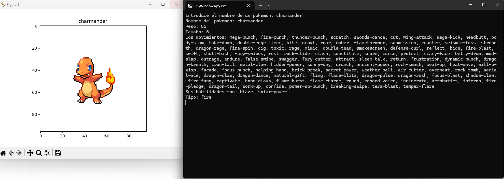

# Proyecto Fundamentos de Python - Módulo 4

Este repositorio contiene un programa desarrollado en Python mediante Visual Studio Code.

## Pokedex

El programa permite buscar información sobre Pokémon, incluyendo imagen, peso, tamaño, movimientos, habilidades y tipo, a partir del nombre del Pokémon proporcionado por el usuario. Los resultados de la búsqueda se guardan en un archivo JSON dentro de una carpeta llamada "pokedex".



## Funcionamiento

Para ejecutar este código, asegúrate de tener instaladas las siguientes bibliotecas de Python:

- **requests**: Para realizar solicitudes HTTP.
- **matplotlib**: Para la visualización de imágenes.
- **PIL (Python Imaging Library)**: Para la manipulación de imágenes.
- **urllib**: Para abrir URLs.
- **json**: Para trabajar con datos JSON.
- **os**: Para manejar archivos y directorios.

Puedes instalar estas bibliotecas utilizando pip con los siguientes comandos en tu terminal o consola:

```bash
pip install requests
pip install matplotlib
pip install Pillow
```

Estos comandos instalarán las bibliotecas necesarias.

### Pasos de Funcionamiento

1. El programa solicita al usuario introducir el nombre de un Pokémon.
2. Utilizando la API de PokeAPI, se busca el Pokémon en el servidor. Si no se encuentra, se muestra un mensaje al usuario.
3. Se obtienen los datos del Pokémon, incluyendo imagen, nombre, peso, tamaño, movimientos, habilidades y tipo.
4. Los datos se guardan en un archivo JSON dentro de la carpeta "pokedex", con el nombre del Pokémon como nombre de archivo.
5. Los resultados se muestran en pantalla.

### Desarrollo del Programa

El desarrollo del programa comenzó definiendo los objetivos de su funcionamiento. Se ideó una solución y se procedió a la programación, creando todas las variables necesarias y realizando pruebas para verificar el correcto funcionamiento de la API. Se mejoró el código agregando diccionarios y listas, y asegurando que los datos se guardaran correctamente en el archivo JSON. Finalmente, se agregaron comentarios para facilitar la comprensión del usuario sobre el funcionamiento del programa.

### Reflexiones del Bootcamp

Durante este módulo 4 de Fundamentos de Python, se adquirieron nuevos conocimientos sobre el manejo de excepciones y control de errores, manipulación de archivos en Python, construcción y consumo de peticiones HTTP a una API, así como el uso eficiente de las APIs para mejorar la funcionalidad de nuestros programas y optimizar el tiempo de desarrollo.

Este conocimiento ha sido fundamental para comprender cómo manejar situaciones inesperadas en nuestros programas, así como para manipular archivos de manera efectiva, lo que nos ha permitido crear aplicaciones más robustas y versátiles.

Además, aprender sobre el consumo de APIs nos ha abierto un mundo de posibilidades en cuanto a la integración de datos externos en nuestras aplicaciones, lo que nos ha permitido crear programas más dinámicos y actualizados.

Este módulo ha sido una pieza clave en nuestro camino de aprendizaje de Python, proporcionándonos las herramientas necesarias para crear programas más sólidos y eficientes, y preparándonos para enfrentar desafíos más avanzados en el futuro.

